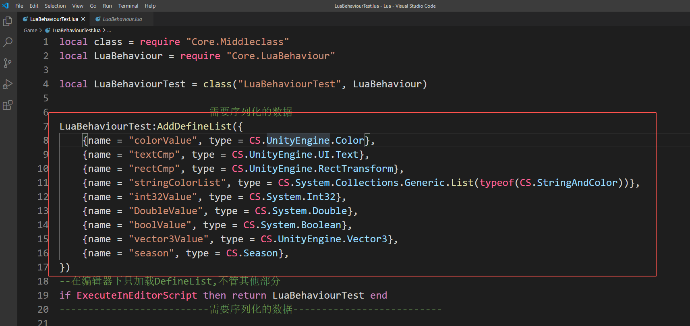
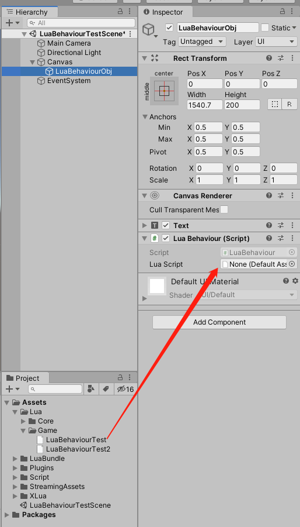
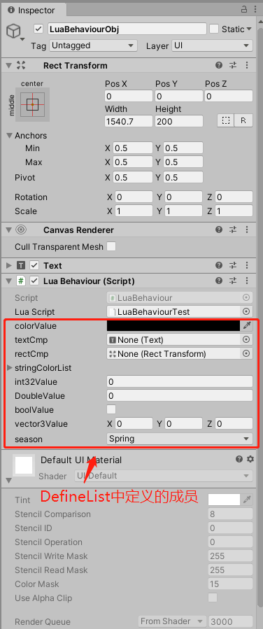
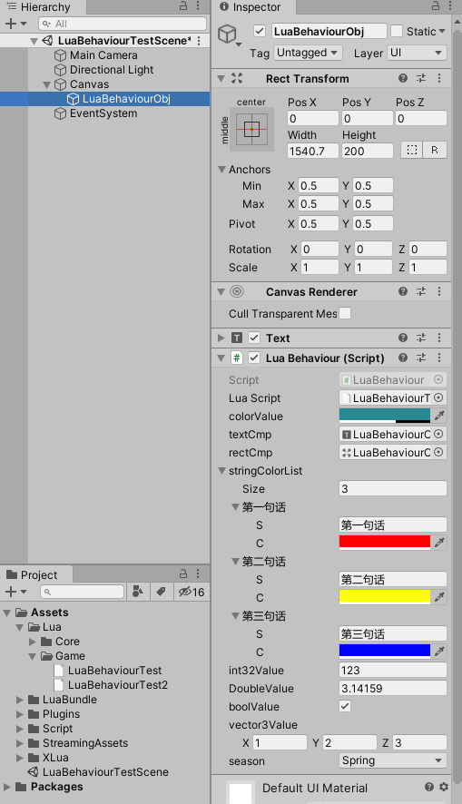
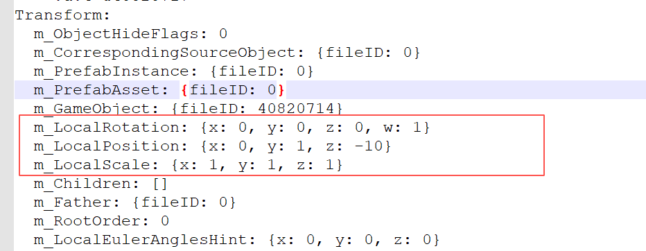
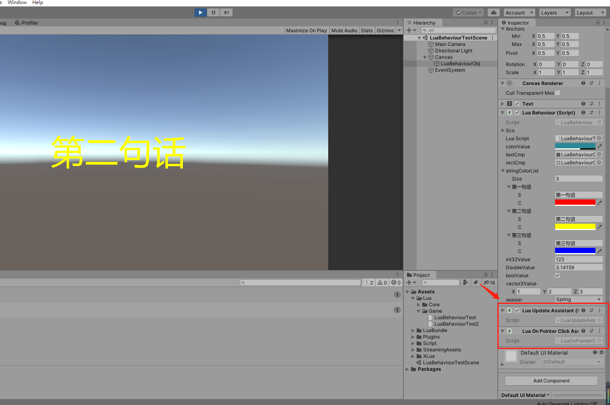

# LuaBehaviourInXLua
XLua下支持多种注入类型的LuaBehaviour
# 简介
&emsp;&emsp;在基于lua进行热更新的项目中，我们通常会通过luaBehaviour来让lua文件模拟MonoBehaviour，可以让lua文件拥有一些MonoBehaviour的生命周期，如Enable、Disable、Update。  
&emsp;&emsp;同时可以注入一些UnityEngine.Object。在lua中方便的调用Unity中的对象。方便开发者进行开发。  
&emsp;&emsp;本文进行介绍的luaBehaviour就是基于这个思路设计的，上面提到的特性之外还通过Json支持了更多类型的注入，Editor界面更人性化的展示，整个开发过程更接近MonoBehaviour的开发体验。  
# 使用
1.新建继承LuaBehaviour的lua文件,通过AddDefineList添加需要序列化的信息。  

2.直接把这个lua文件拖到CS中的LuaBehaviour上即可。  

&emsp;&emsp;接下来可以像MonoBehaviour一样对数据进行编辑了。  

# 实现
## 脚本的序列化
&emsp;&emsp;luaBehaviour在使用的时候一般是通过记录名字或路径的方式来序列化lua文件的的。打包后通过这个路径从AssetBundle中进行lua文件的加载（这个是lua脚本热更新常用的策略，在这边就不多说了）。
&emsp;&emsp;这里还是通过路径来记录lua文件，但是不需要手动输入，而是通过直接拖动的方式间接记录lua文件路径。
## 注入的方式
&emsp;&emsp;不通过C#侧定义注册信息，而是通过在Lua中先定义好要注册的类型和名称（更符合MonoBehaviour的开发姿势）。开发时，Editor读取lua中定义的类型和名称信息，展示在Inspector中，供开发者编辑。
&emsp;&emsp;在运行时再将序列化的数据注入到lua实例中。
### 序列化的实现
#### UnityEngine.Object类型对象的序列化
&emsp;&emsp;这种类型没啥特别的，在LuaBehaviour脚本中定义一个记录key和UnityEngine.Object的List即可。  
#### 其他类型的序列化  
&emsp;&emsp;非UnityEngine.Object类型就没有一个统一的格式，无法通过一个列表简单的进行记录。但是我们查看Prefab的实例可以发现，Prefab序列化的数据其实和Json很像。对在MonoBehaviour中定义的各个字段的序列化姿势也和Json很像。  
  
&emsp;&emsp;所以这里考虑使用Json来序列化非UnityEngine.Object类型的对象。刚好Unity由提供了一套简单高效的Json工具JsonUtility。JsonUtility内部就是通过Unity serializer实现的，所以稳定性很有保证。  
&emsp;&emsp;但是JsonUtility有个缺点，只能序列化一部分类型，不能序列化如Int、List这种类型。
&emsp;&emsp;为了解决这个问题。这里在序列化的时候通过泛型为每个类型生成一个Wrap类型。即可通用的实现各种类型的序列化。 
  
### 注入的实现
#### UnityEngine.Object类型对象的注入
&emsp;&emsp;也没啥好说的，直接根据key向Lua实例中Set即可。  
#### 其他类型的注入
&emsp;&emsp;先实例化为Wrap对象，然后再取出其中的需要注入的对象，Set到Lua对象中即可。 
### Inspector界面中的展示
#### UnityEngine.Object类型对象的展示
&emsp;&emsp;UnityEngine.Object类型统一使用EditorGUILayout.ObjectField绘制即可。  
#### 其他类型的展示
&emsp;&emsp;因为没有找到一个通用的可以表现所有对象的绘制方式，所以这里也做了一个转换。先通过Emit生成一个继承自ScriptableObject的类（因为ScriptableObject是UntiyEngine.Object，所以可以使用SerializedObject来绘制。同时可以直接通过ScriptableObject.CreateInstance进行实例的创建）。把需要绘制的对象放到这个类里面，然后通过EditorGUILayout.PropertyField绘制即可。  
## Enable、Update等函数的调用
&emsp;&emsp;这里把Update、FixedUpdate等高频或者很少使用的函数拆分出去，只有在Lua中定义了这些函数，才添加对应的Assistant脚本对这些函数进行调用。  

&emsp;&emsp;Enable、Disable、Destroy这三个常用函数，就直接放在LuaBehaviour脚本中进行调用。  
# Tips
1. 这篇文章只起到大致思路和关键点的说明，具体细节可以直接看代码，代码比较少也比较清晰。
2. 通过Wrap的方式序列化各种对象的方式其实也可以考虑用到一些用户数据在客户端的持久化。 
3. 因为这边主要展示LuaBehanviour的功能，所以AssetBundle的生成和从AssetBundle中加载lua文件都写得很临时，仅作展示用。   
4. 打包测试之前要用AssetBundles->Build AssetBundle For Lua生成一下bundle。  
